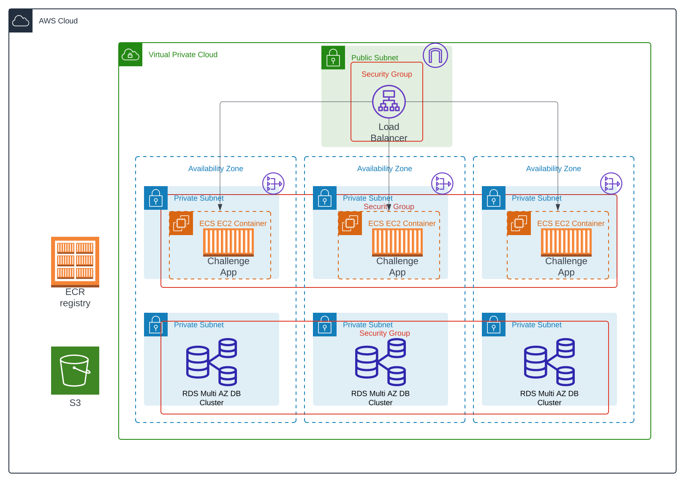

# Skyward DevOps Challenge Solution

This is the requirements for local development as well the list of changes made.
## Local Development Requirements
 - [Go 1.22 or later](https://go.dev/doc/install)
 - [Dive](https://github.com/wagoodman/dive)
 - [Kind](https://kind.sigs.k8s.io/docs/user/quick-start#installation)
 - [Helm](https://helm.sh/docs/intro/install/)
 - [Docker](https://docs.docker.com/engine/install/)
 - [kubectl](https://kubernetes.io/docs/tasks/tools/#kubectl)
 - A running Kubernetes cluster

### Makefile
There exist a makefile to quickly do common commands such as building, running helm, etc. Please read it for a comprehensive list of 
 
## Changes
Following will be a list of changes i made to the project requirements and structure.

### File structure 

I flatten the folder structure and no longer have challenge 1-3. The root contains the dockerfile and the go code being challenge 1, devops-challenge-chart has the helm chart, and terraform has the terraform manifest files.

### Infrastructure

I made some mild changes to the infrastructure to better match practices I am familiar with and to utilize the docker image created in the earlier part of this challenge. For a full understanding of changes below is the updated infrastructure. I used ec2s instead of fargate to still create the ec2s as requested.

## Deficiencies  

This is a list of flaws I either do not have the time or expertise to address.

 - Ordering of ecr repository creation
 - Hardcoding of backend in terraform
 - Hardcoding of ecr repository
 - Github actions needing aws token to apply terraform state
 - Terraform file organization i.e. all of the terraform is in one large file and this should be broken into either modules or a multiple files for ease of maintenance
 - Inconsistent tagging in resource creation
 - Utilizing ECS instead of EKS
 - Appropriate iam roles
 - Naming conventions
 - Additional variables in terraform i.e. repo name, build name, region name